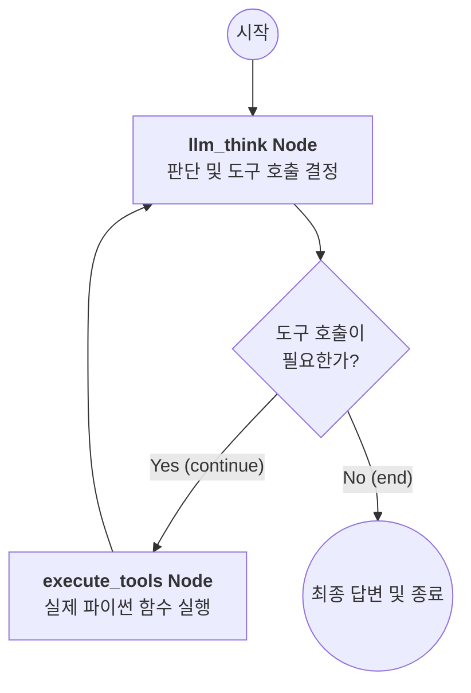
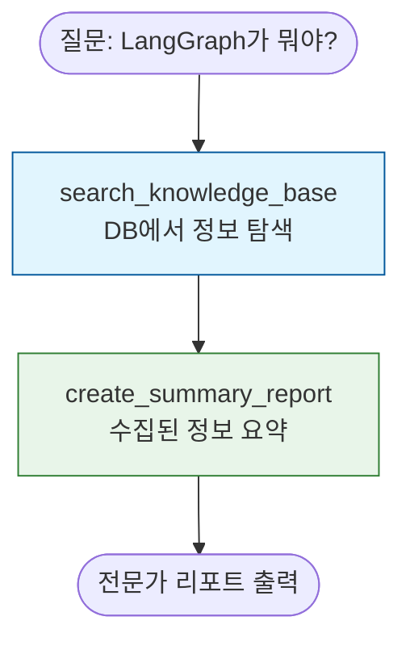
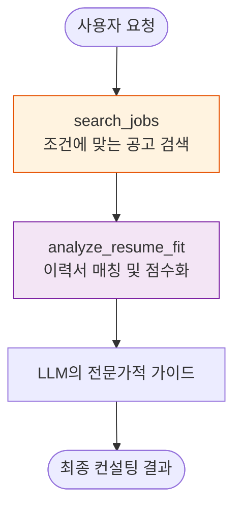

# 🕸️ LangChain & LangGraph 에이전트 마스터 가이드

이 저장소는 LLM 에이전트의 구조적 이해를 돕기 위해 **LangChain(선형 체인)**과 **LangGraph(상태 기반 그래프)**의 차이점을 분석하고, 이를 실무에 응용하여 엔진화한 사례를 담고 있습니다.

---

## 1. 프레임워크별 핵심 차이 (Conceptual Comparison)

부모 폴더의 OpenAI SDK, CrewAI 등과 비교했을 때 LangGraph가 가지는 독보적인 위치입니다.

| 구분 | OpenAI SDK | CrewAI | LangGraph |
| :--- | :--- | :--- | :--- |
| **핵심 개념** | 단순 API 호출 | 역할 기반 협업 (Role-Play) | **상태 머신 (State Machine)** |
| **제어 수준** | 가장 높음 (수동) | 낮음 (프레임워크 주도) | **최상 (모든 분기와 루프 통제)** |
| **추상화** | 없음 | 매우 높음 | 중간 (엔진 설계를 직접 수행) |
| **비유** | 개별 부품 구매 | 완제품 자율주행차 | **자동차 엔진 설계 및 튜닝** |

### 💡 왜 LangGraph가 더 어렵고 강력한가?
CrewAI는 "연구원" 에이전트를 만들면 내부적으로 어떻게 생각하는지 알기 어렵습니다. 하지만 **LangGraph는 LLM이 '생각하는 단계(Node)'와 '다음 단계로 갈지 결정하는 조건(Edge)'을 코드 레벨에서 하나하나 정의**해야 합니다. 이 과정이 번거롭지만, 기업용 서비스에서 요구하는 **정교한 업무 로직과 예외 처리**를 완벽하게 제어할 수 있는 유일한 방법입니다.

---

## 2. LangGraph 핵심 메커니즘 상세 설명

### ① State (상태: 에이전트의 기억 장치)
에이전트가 노드(작업)를 거칠 때마다 정보를 담아두는 '바구니'입니다.
- **Annotated[list, operator.add]**: 메시지가 들어올 때 기존 것을 지우지 않고 뒤에 덧붙여 대화 문맥(Context)을 유지합니다.

### ② Node (노드: 행동 대장)
실제로 일을 하는 함수들입니다.
- **LLM Node**: "지금까지의 상황을 보니 다음엔 이 도구를 써야겠어"라고 판단합니다.
- **Tool Node**: AI의 판단에 따라 실제 파이썬 코드(검색, 계산 등)를 실행합니다.

### ③ Edge (엣지: 사고의 경로)
- **Conditional Edge**: "결과가 만족스러우면 종료하고, 부족하면 다시 검색해!"와 같은 **루프(Cycle)**를 만듭니다.

---

## 3. 파일별 기능 및 도식도 (Architecture)

### ⚙️ [공통 엔진] agent.py
모든 에이전트의 뇌 구조를 담당하는 Skeleton 코드입니다. 노드와 엣지의 순환 구조를 클래스화하여 재사용성을 극대화했습니다.



### 🔍 [구현체 1] main.py (기술 연구 전문가)
`agent.py` 엔진에 기술 검색 도구와 전문가 정체성을 부여한 사례입니다.



### 👔 [구현체 2] job_hunter.py (커리어 코치)
더 복잡한 멀티 도구 시나리오를 처리하는 채용 특화 에이전트입니다.



### 📗 [비교 예제] langchain_agent.py & langgraph_agent.py
두 프레임워크의 코드 레벨 차이를 보여주기 위한 순수 비교 파일입니다.
- **LangChain**: `AgentExecutor`를 통해 빠르게 에이전트를 생성하는 선형 구조.
- **LangGraph**: `StateGraph`를 통해 사고의 단계를 노드로 직접 쪼개는 그래프 구조.

---

## 4. 실행 방법 (uv 활용)

이 프로젝트는 최신 파이썬 패키지 매니저인 **`uv`**를 사용하여 별도의 가상환경 설정 없이 즉시 실행할 수 있습니다.

### ① 환경 변수 설정
`.env` 파일에 API 키를 입력하세요.
```text
OPENAI_API_KEY=your_api_key_here
```

### ② 실행 명령어
```bash
# 기술 연구 에이전트 실행
uv run main.py

# 채용 컨설팅 에이전트 실행
uv run job_hunter.py

# 프레임워크 차이 비교 실행
uv run langchain_agent.py
uv run langgraph_agent.py
```

---

## 5. 핵심 함수 및 코드 설명 (Deep Dive)

- **`model.bind_tools(tools)`**: LLM에게 사용할 수 있는 기술(함수) 목록을 전달합니다.
- **`workflow.add_conditional_edges`**: 단순한 순서대로 실행되는 것이 아니라, LLM의 결과에 따라 동적으로 다음 노드를 결정합니다. 이것이 LangGraph를 '인공지능다운' 에이전트로 만드는 핵심입니다.
- **`astream(inputs)`**: 비동기 스트리밍 방식으로 에이전트가 단계별로 무슨 생각을 하는지 실시간으로 출력합니다.
