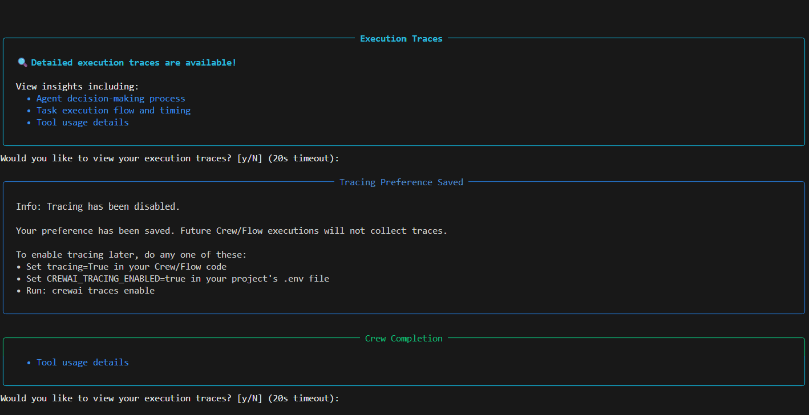
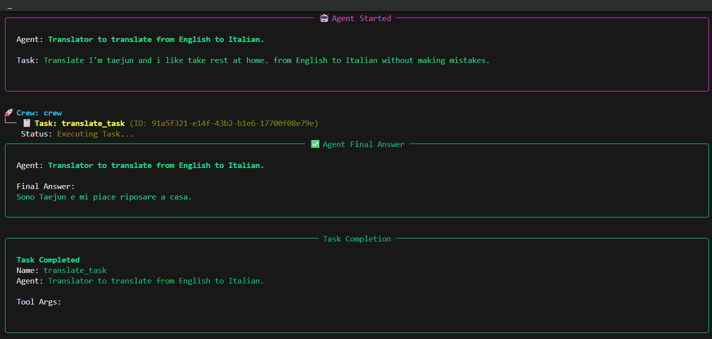
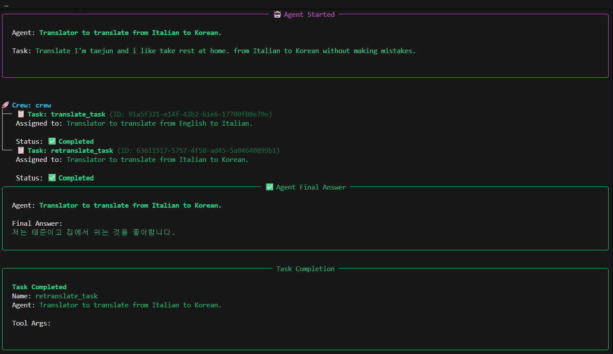
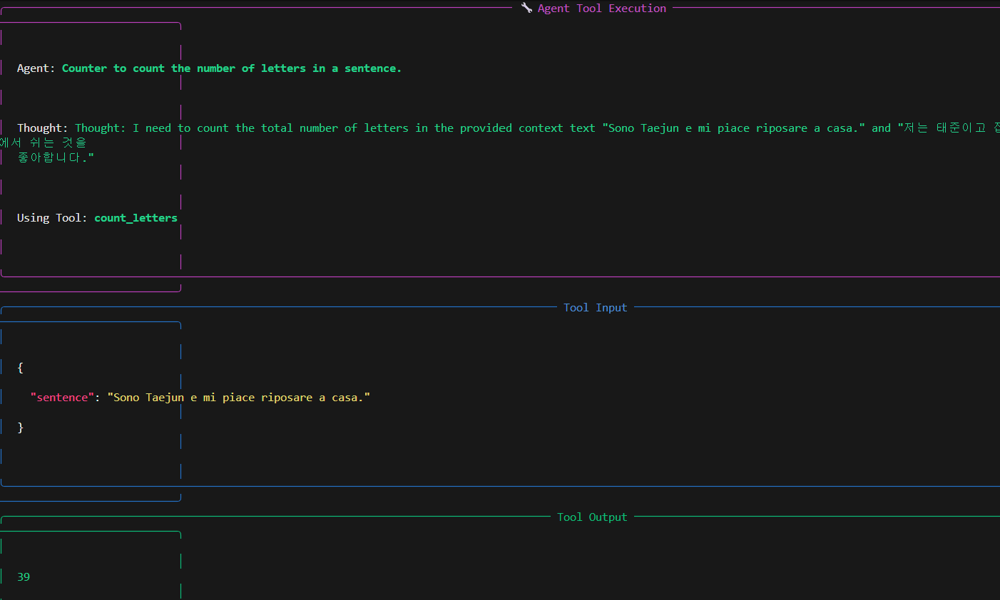
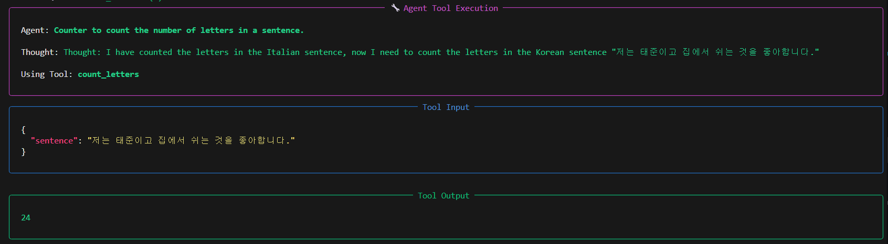

# CrewAI News Reader Project

## 🖥️ 실행 결과 로그 (Execution Logs)

---

### 📅 2025.12.26 (Step 1. 기본 번역 에이전트)
기본적인 '영어 -> 이탈리아어 -> 한국어' 번역 및 글자 수 세기 기능 구현

*▲ 실행 초기 화면*

*▲ 번역 수행 로그*

*▲ 최종 결과 확인*

 

---

### 📅 2025.12.30 (Step 2. 에이전트 분리 및 로직 개선)
에이전트 역할 분리(영어 담당, 한국어 담당) 및 Context 기반 카운팅 정확도 향상

*▲ Step 2 agent분리 후 결과 실행 1*

*▲ Step 2 agent분리 후 결과 실행 2*

*▲ Step 2 첫번째 번역 실행 후 개수 세기 적용 결과*

*▲ Step 2 두번째 번역 실행 후 개수 세기 적용 결과*