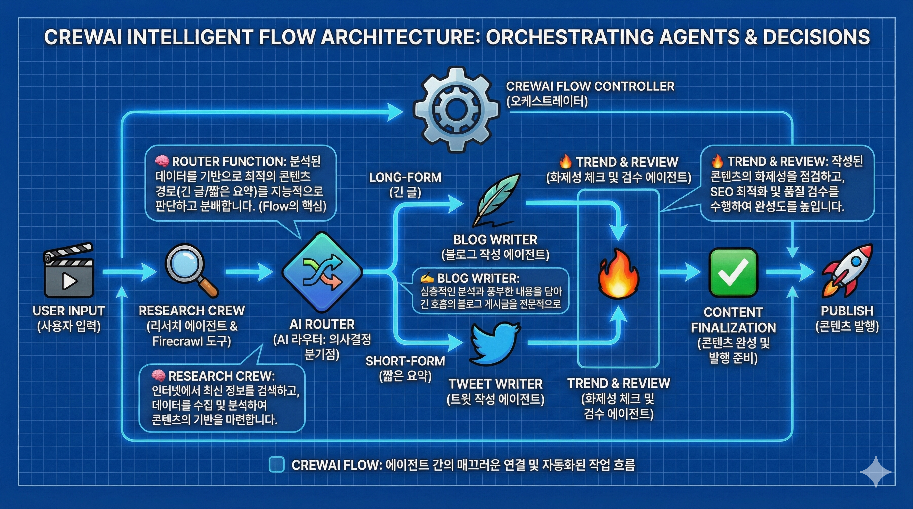
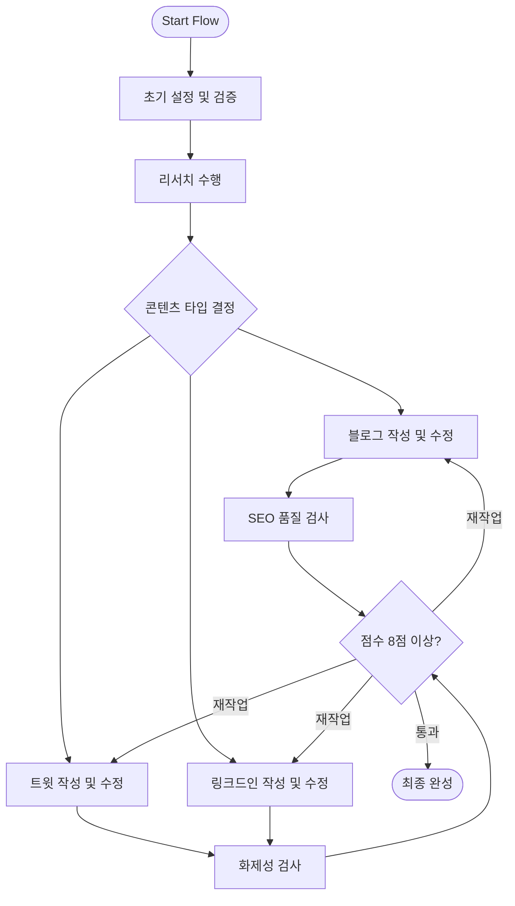

# CrewAI Content Pipeline Flow

이 프로젝트는 CrewAI의 Flow 기능을 활용하여 콘텐츠 생성 파이프라인을 구축하는 예제입니다.

## 🏗️ 아키텍처 다이어그램 (Architecture)

아래 다이어그램은 리서치부터 발행까지 이어지는 에이전트의 워크플로우를 보여줍니다.

---

## 🏗️ Detailed Flow Architecture

