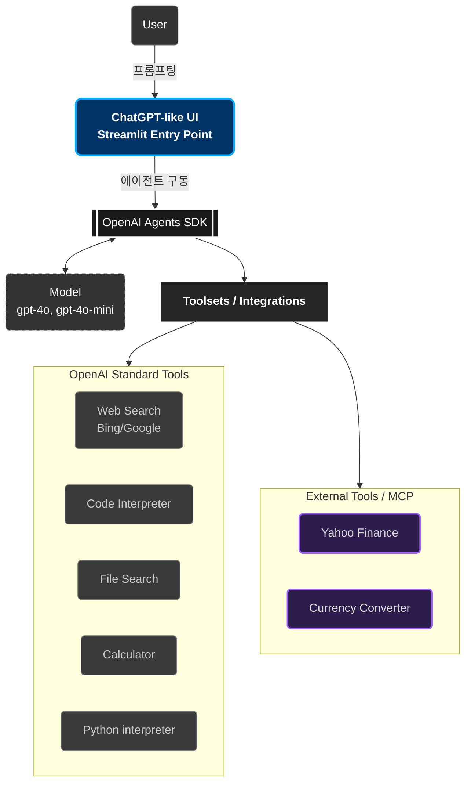
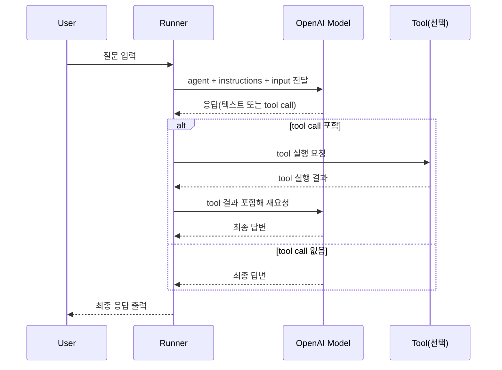

# Part 7: OpenAI Agents SDK (ChatGPT Clone)

## 🏗️ System Architecture



### 🎯 강의 목표

OpenAI의 Agents SDK와 Streamlit을 사용하여 한층 더 강화된 버전의 ChatGPT를 구축합니다. 이 에이전트는 웹 검색, 코드 실행, 이미지 생성 같은 핵심 기능은 물론, MCP를 통해 Yahoo Finance 데이터 조회나 환율 변환 같은 여러 외부 도구를 동시에 활용하는 강력한 기능까지 포함합니다.

## 🤖 Dummy Agent: Runner를 쓰는 이유

Dummy agent를 만들 때 `Runner`를 사용하는 핵심 이유는, 단순히 "모델 1회 호출"이 아니라 **에이전트 실행 루프 전체를 표준 방식으로 관리**해주기 때문입니다.

`Runner`는 내부적으로 아래와 같은 반복 루프를 수행합니다.

1. Agent + Input으로 모델에 요청
2. 모델 응답 파싱
3. Tool 호출 필요 여부 판단
4. 필요하면 Tool 실행 후 결과를 다시 모델에 전달
5. 최종 응답이 나오면 종료하고 사용자에게 반환

즉, 우리가 적어둔 설명처럼 `while true`에 가까운 오케스트레이션을 `Runner`가 책임집니다.

### Runner 실행 구조도 (Flow)

```mermaid
flowchart TD
    A[시작: Runner.run(agent, user_input)] --> B[대화 컨텍스트 구성\n(agent instructions + history + input)]
    B --> C[OpenAI 모델 호출]
    C --> D[모델 응답 파싱]
    D --> E{Tool 호출 필요?}
    E -- 예 --> F[해당 Tool 실행]
    F --> G[Tool 결과를 대화 컨텍스트에 추가]
    G --> C
    E -- 아니오 --> H[최종 응답(final response) 확정]
    H --> I[Runner가 결과 반환]
```

### Runner 실행 시퀀스 (Sequence)



### 단계별 상세 설명

1. 입력 수집
사용자 입력과 Agent 설정(`name`, `instructions`, `tools`)을 Runner가 묶어서 실행 단위를 만듭니다.

2. 모델 호출
Runner는 OpenAI 모델에 요청을 보내고, 일반 텍스트 응답인지 tool call 응답인지 확인할 준비를 합니다.

3. 응답 파싱
모델 출력에서 구조화된 신호(예: tool 호출 의도, 인자)를 읽어 다음 액션을 결정합니다.

4. Tool 실행 분기
Tool 호출이 필요하면 Runner가 직접 해당 함수를 실행합니다. 이때 필요한 인자를 전달하고 실행 결과를 수집합니다.

5. 재호출 루프
Tool 결과를 다시 모델에 전달하여 후속 추론을 진행합니다. Tool이 연쇄적으로 필요하면 이 과정을 반복합니다.

6. 종료 조건
더 이상 tool call이 없고 사용자에게 보여줄 최종 텍스트가 생성되면 루프를 종료하고 결과를 반환합니다.

### Dummy Agent 코드와 연결해서 보기

`dummy_agent.ipynb`에 있는 아래 호출이 위 전체 루프를 실행합니다.

```python
result = await Runner.run(agent, "Hello how are you?")
```

이 한 줄이 하는 일은 "모델 한 번 호출"이 아니라,
**모델 호출 → 파싱 → tool 실행(필요 시) → 재호출 → 최종 응답 반환**까지의 전 과정을 담당하는 것입니다.

### 학습 포인트 정리

- `Agent`는 역할/규칙/도구 정의
- `Runner`는 실행 오케스트레이션(루프, 분기, 종료)
- 도구가 많아질수록 `Runner`의 가치가 커짐
- 실무에서는 직접 루프를 구현하기보다 `Runner`로 표준화하는 것이 안정적

## 📘 오늘 강의 마무리 노트

오늘은 OpenAI Agents SDK의 가장 기초이자 핵심인 **Agent + Runner + Tool 연결 흐름**을 학습했습니다.

우리가 작성한 dummy agent 코드는 "에이전트를 정의하고 호출하면 내부에서 어떤 일이 일어나는지"를 눈으로 확인하기 위한 최소 예제입니다.

### 오늘 실습 코드의 의미

```python
from agents import Agent, Runner, function_tool

@function_tool
def get_weather(city: str):
    """get weather by city"""
    print(city)
    return "30 degrees"

agent = Agent(
    name="Assistant Agent",
    instructions="You are a helpful assistant. Use tools when needed to answer questions",
    tools=[get_weather],
)

stream = Runner.run_streamed(
    agent,
    "Hello how are you? what is the weather in the capital of korea",
)
```

핵심은 `Runner.run_streamed(...)`를 호출하는 순간부터,
에이전트 실행 루프(모델 요청 → 응답 파싱 → tool 호출 판단 → tool 실행 → 재요청 → 최종 응답)가 자동으로 진행된다는 점입니다.

### stream 이벤트에서 본 결과 타입 해설

`async for event in stream.stream_events()`에서 관찰한 항목은 다음 의미를 가집니다.

- `tool_call_item`: 에이전트가 "이 문제를 풀기 위해 tool이 필요하다"고 판단해 tool 호출을 생성한 단계
- `tool_call_output_item`: 실제 tool 함수가 실행되고 결과값이 반환된 단계
- `message_output_item`: tool 결과까지 반영해 에이전트가 사용자에게 최종 메시지를 생성한 단계

즉, 우리가 적어둔 주석 설명은 단순 추측이 아니라, 스트리밍 이벤트 로그로 검증된 실행 순서입니다.

### 2026.04.01(수) 학습 한 줄 정리

"Agent를 호출해서 사용한다"는 말의 실제 의미는,
**Runner가 에이전트 실행 전 과정을 반복 오케스트레이션하면서 최종 답을 완성해 주는 흐름**이라는 것입니다.

### 커밋 메시지에 써도 좋은 마무리 문구

이번 파트에서는 dummy agent를 통해 Agents SDK의 기본 실행 구조를 이해했다.
Runner는 모델 호출 1회 도구가 아니라, tool 호출/결과 반영/재요청을 포함한 전체 루프를 관리한다.
`run_streamed` 이벤트(`tool_call_item` → `tool_call_output_item` → `message_output_item`)를 통해 에이전트 내부 동작을 직접 확인했다.
