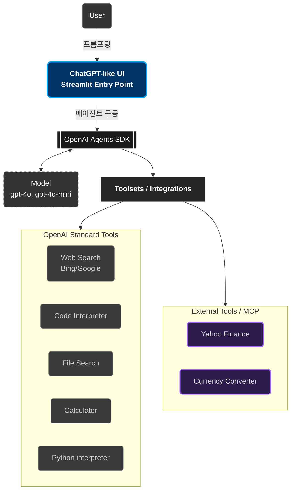

# Part 7: OpenAI Agents SDK (ChatGPT Clone)

## 🏗️ System Architecture

### 🎯 강의 목표
OpenAI의 Agents SDK와 Streamlit을 사용하여 한층 더 강화된 버전의 ChatGPT를 구축합니다. 이 에이전트는 웹 검색, 코드 실행, 이미지 생성 같은 핵심 기능은 물론, MCP를 통해 Yahoo Finance 데이터 조회나 환율 변환 같은 여러 외부 도구를 동시에 활용하는 강력한 기능까지 포함합니다.