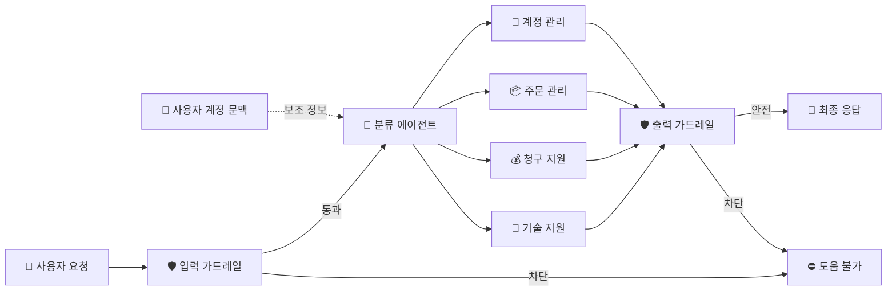

# Part 9. Customer Support Agent

이 파트의 핵심은 "고객지원" 자체가 아니라, **가드레일을 중심으로 에이전트가 어떻게 안전하게 생각하고 응답하는지**를 이해하는 것입니다.

지금 단계에서는 세부 모듈 구현보다, 아래 **가드레일 중심 아키텍처**를 먼저 잡는 것이 중요합니다.

이 예제는 고객지원 도메인을 빌려서 에이전트가 다음 순서로 움직이는 모습을 보여줍니다.

1. 사용자의 요청이 들어오면 먼저 입력 가드레일이 주제를 확인하고
2. 통과한 요청만 분류 에이전트로 넘기고
3. 분류 에이전트는 사용자 계정 문맥을 참고해 라우팅을 결정하고
4. 선택된 응답 경로는 출력 가드레일을 다시 통과한 뒤에만 사용자에게 보여집니다.

## 이 파트에서 먼저 봐야 할 것

- 사용자가 보낸 입력이 곧바로 에이전트로 들어가지 않는다는 점
- 입력이 먼저 가드레일을 통과해야 한다는 점
- 분류 에이전트가 "무슨 종류의 요청인지"를 판단한다는 점
- 사용자 계정 정보가 필요한 경우 문맥으로 주입된다는 점
- 최종 응답도 다시 한 번 출력 가드레일을 지난 뒤 사용자에게 전달된다는 점

즉, 이 README의 목적은 코드 구현 상세를 외우는 것이 아니라, **가드레일이 에이전트의 앞과 뒤를 감싸는 구조**를 한눈에 이해하는 것입니다.

## 전체 흐름



## 코드에서 보는 실제 구조

`main.py`는 음성 입력을 받아서 아래 순서로 처리합니다.

```python
audio_input = st.audio_input("Record your message")
```

1. 사용자가 음성으로 메시지를 입력합니다.
2. `convert_audio()`가 WAV 데이터를 `numpy` 배열로 바꿉니다.
3. `AudioInput`으로 래핑해서 `VoicePipeline`에 넘깁니다.
4. `CustomWorkflow(context=user_account_ctx)`가 실행됩니다.
5. 워크플로우 내부에서 가드레일과 분류 로직이 동작합니다.
6. 최종적으로 `result.stream()`을 통해 오디오 응답이 재생됩니다.

## main.py 기준 핵심 포인트

### 1. 입력 가드레일

입력은 바로 에이전트로 들어가지 않고 먼저 검증됩니다.

- 고객지원과 무관한 요청이면 차단
- 너무 위험하거나 범위를 벗어나면 차단

이 단계가 필요한 이유는, 에이전트가 모든 요청을 그대로 받는 구조보다 훨씬 안전하기 때문입니다.

### 2. 분류 에이전트

입력이 적절하면 `triage_agent`가 요청을 분류합니다.

이 에이전트의 역할은 답을 직접 길게 만드는 것보다:

- 기술 지원인지
- 청구 지원인지
- 주문 관리인지
- 계정 관리인지

같은 라우팅 결정을 내리는 것입니다.

여기서 중요한 점은, 분류 에이전트도 무작정 답을 만드는 주체가 아니라는 것입니다.
가드레일이 먼저 "이 요청을 받아도 되는지"를 확인하고, 그다음에 분류가 일어납니다.

### 3. 사용자 계정 정보

`UserAccountContext`는 분류와 응답에 필요한 사용자 문맥을 제공합니다.

예시:

- `customer_id`
- `name`
- `tier`

이 정보는 같은 질문이라도 사용자 상태에 따라 다른 응답이 필요할 때 중요합니다.

즉, 에이전트는 "무슨 말이 왔는지"만 보는 게 아니라, "누가 말했는지"도 함께 참고합니다.

### 4. 출력 가드레일

분류 에이전트가 만든 최종 응답도 바로 사용자에게 보여주지 않습니다.

출력 검증 필터가 한 번 더 확인해서:

- 실제로 보여줘도 되는지
- 정책에 어긋나지 않는지
- 고객지원 범위를 벗어나지 않는지
- 사용자에게 위험한 방식으로 표현되지 않았는지

를 검사한 뒤에만 최종 응답으로 보냅니다.

즉, 출력 가드레일은 "답을 만든 뒤에도 한 번 더 브레이크를 밟는 장치"입니다.

## 코드와 연결해서 보면 좋은 부분

- `[main.py](./main.py)`에서 `InputGuardrailTripwireTriggered`와 `OutputGuardrailTripwireTriggered`를 처리합니다.
- `[main.py](./main.py)`에서 `CustomWorkflow(context=user_account_ctx)`를 생성합니다.
- `[main.py](./main.py)`에서 `VoicePipeline(workflow=workflow)`로 실제 실행 파이프라인을 구성합니다.
- `[main.py](./main.py)`에서 `st.status()`와 `result.stream()`으로 진행 상태와 음성 스트리밍을 보여줍니다.

## 왜 이 구조가 중요한가

이 예제의 진짜 학습 포인트는 "고객지원 봇"이 아니라, **에이전트를 시스템처럼 설계하는 방식**입니다.

즉:

- 입력을 무조건 믿지 않고
- 에이전트를 한 번 분류하고
- 사용자 문맥을 붙이고
- 출력도 다시 검증하는

안전한 에이전트 아키텍처를 익히는 데 있습니다.

가드레일 관점에서 보면 이 구조는 다음처럼 이해하면 좋습니다.

- 입력 가드레일은 "받아도 되는 질문인지"를 보는 1차 방어선
- 분류 에이전트는 "어느 경로로 처리할지"를 정하는 라우터
- 사용자 계정 문맥은 "누구의 요청인지"를 보강하는 정보
- 출력 가드레일은 "이 답을 내보내도 되는지"를 보는 2차 방어선

## 한 줄 요약

사용자 입력은 곧바로 답으로 변하지 않고, `입력 가드레일 -> 분류 에이전트 -> 사용자 문맥 -> 출력 가드레일`을 거쳐서만 최종 응답이 됩니다.

## 실행

```bash
streamlit run main.py
```

## 참고

- 이 프로젝트는 음성 입력 기반 예제입니다.
- 화면에 보이는 텍스트 채팅보다, 실제로는 오디오 입력과 오디오 출력이 중심입니다.
- 가드레일은 단순한 예외 처리보다 더 앞단과 뒷단에서 안전장치 역할을 합니다.
